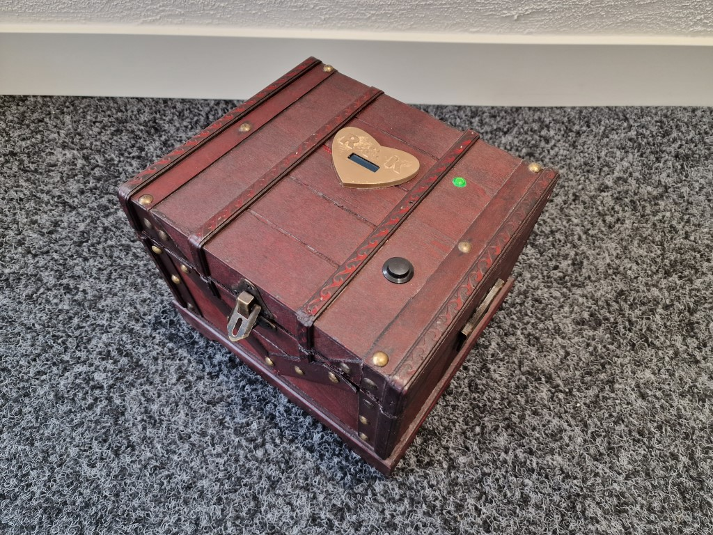
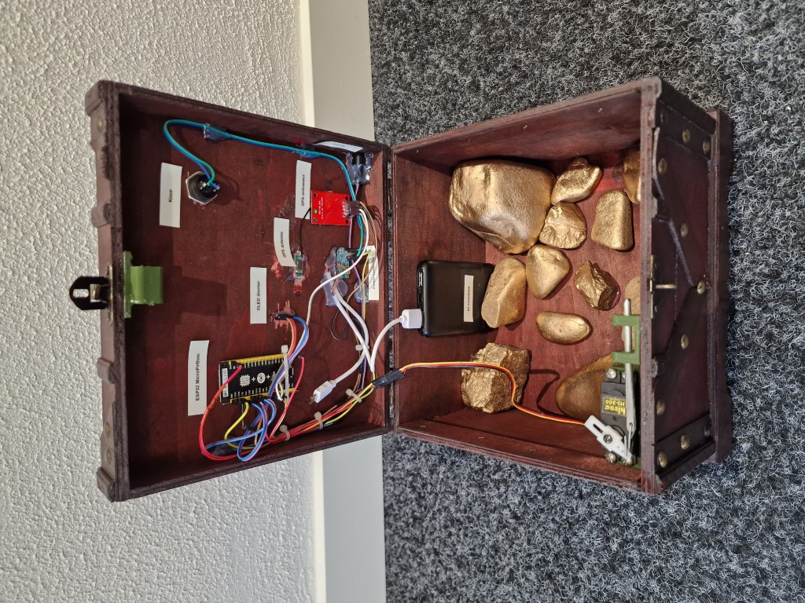
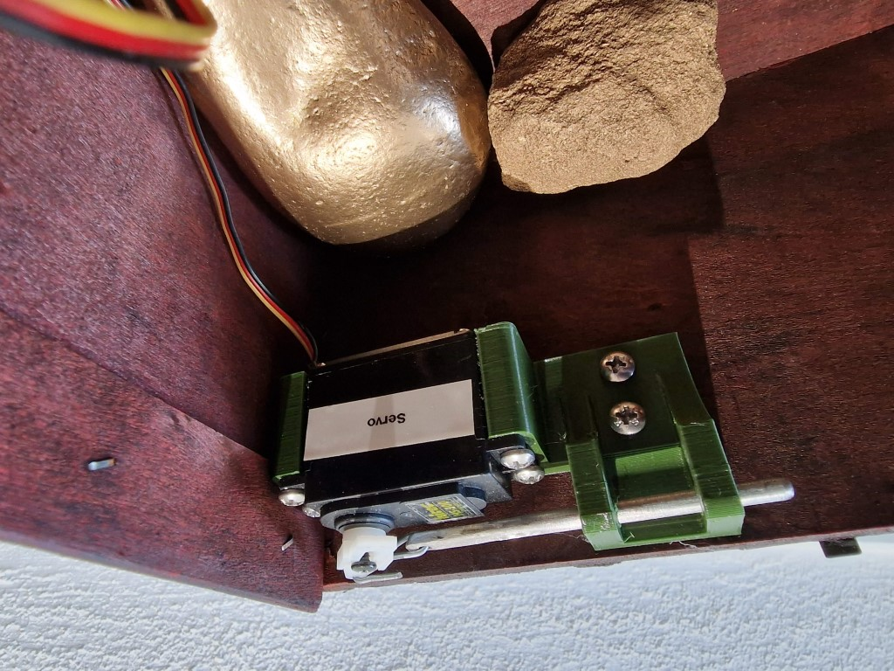
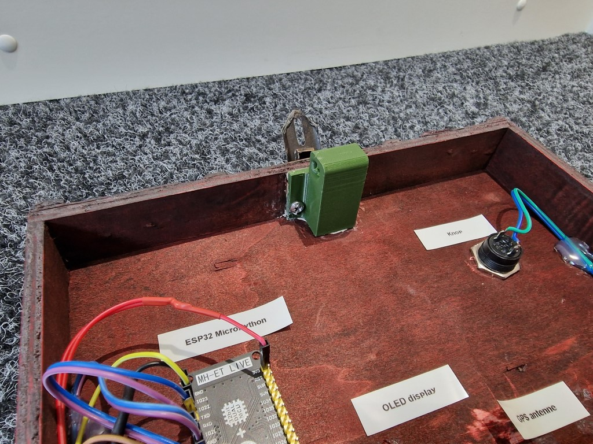
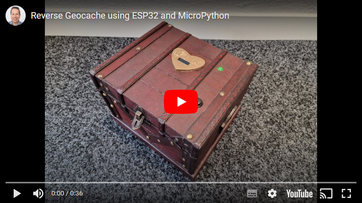

# Reverse Geocache using an ESP32 with MicroPython

A reverse geocache is a present in a box that only opens at a certain physical location. Finding the location requires a little puzzling, because the box will only show the distance to the location. Normally a [geocache](https://en.wikipedia.org/wiki/Geocaching) is a treasure hunt puzzle that brings you to a location where you find a hidden container, but with a reverse geocache you bring the container with you.

The original idea comes from [Mikal Hart](http://arduiniana.org/projects/the-reverse-geo-cache-puzzle/) and several [clones](https://learn.adafruit.com/reverse-geocache-engagement-box?view=all) can be found around the internet. This variant is inspired by the other reverse geocaches, but is implemented in [MicroPython](https://en.wikipedia.org/wiki/MicroPython) on an [ESP32 microcontroller](https://en.wikipedia.org/wiki/ESP32).

## Parts

 - [Box](https://www.amazon.com/dp/B07CMYPQVV)
 - [ESP32 development board](https://aliexpress.com/wholesale?SearchText=MH-ET+Live+ESP32)
 - [Servo](https://aliexpress.com/wholesale?SearchText=servo)
 - [GPS receiver](https://aliexpress.com/wholesale?SearchText=NEO-6M)
 - [Display](https://aliexpress.com/wholesale?SearchText=128X32+Oled)
 - [Button](https://aliexpress.com/wholesale?SearchText=momentary+push+button)
 - [Power controller](https://sparkfun.com/products/8903)
 - Powerbank
 - [Dupont wires](https://aliexpress.com/wholesale?SearchText=dupont+wires)
 - [3D printed lock mechanism](https://www.thingiverse.com/thing:5689225)

 
 

 ## Working
 After building the box, the present can be put inside. Before wrapping it in gift paper, the button has to be pushed once. This will engage the lock. 
 
 When the present is unwrapped, the person doesn't know what it is and will push the button. It will show a welcome message and play a tune. Then it will start searching for GPS signals. It will search for 5 minutes before turning off. During the next attempts it will show a message that you have to be patient and even outdoors it can take a couple of minutes.

 When a GPS signal is found, it will show the distance to the destination (10m precision). It will keep updating the distance when moving, but it will turn off after 1 minute to make it is not _too_ easy to find the destination. 
 
 It shows how many attempts were made. Maximum 50 attempts are allowed. After 50 attempts it shows a failure message and play a sad tune. But after waiting 10 seconds the program continues, so that it is still possible to find the destination and unlock the box.

 When the distance is less than 20 meters from the configured destination, it will show that the location is found and the next location has to be discovered. The person doesn't know how many locations will follow, but the number of remaining attempts keeps decreasing.

 After the second destination has been found, the puzzle is complete. It will open the lock, play a winning tune and display a congratulations message. After that it will show a greetings message and turn off after 1 minute.

 

 ## Messages
 
 
 
 
 
 
 
 
 